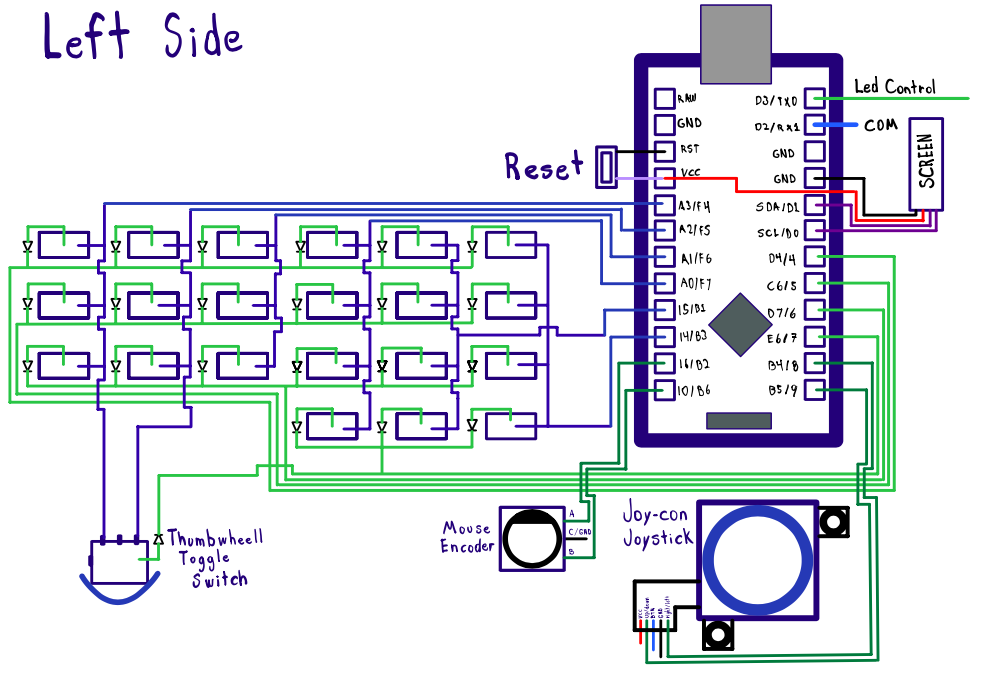
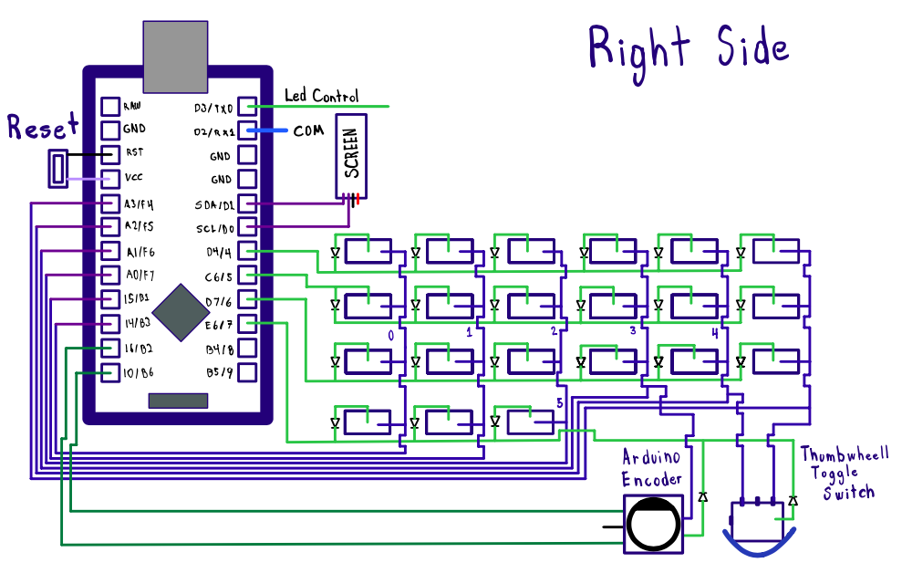
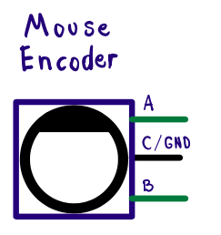
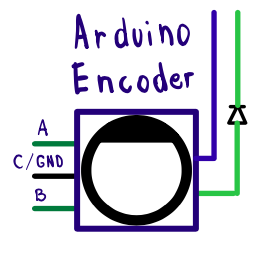
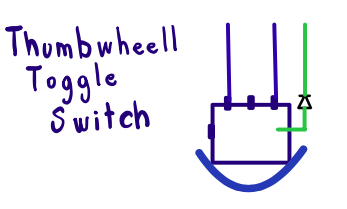

# Diagrams

## Left side

As you can notice the Joystick it's conected to the 8 and 9 pins
and the encoders are conected to B6 and B2, in my case I don't have 
a Thumbwheel on my leftside only on the right side but it is possible
to have it on both sides or only one side.

## Right side

I use an arduino encoder module since was easier to attatch to the keyboard without doing
big modifications on the corne, on the arduino Encoder module I modify the whole module to be able to work properly with the Qmk code. 
I disconeted the encoder from it's original outputs and I conected to the Corne as described on
the diagram.

Remenber to conect the encoder only on B6 and B2

* Don't fortget to conect the Joystick and the encoder to Vcc and ground.

## Mouse Encoder

## Anduino Encoder

## Thumbwheel button

* Hope the diagrams are clear enought.